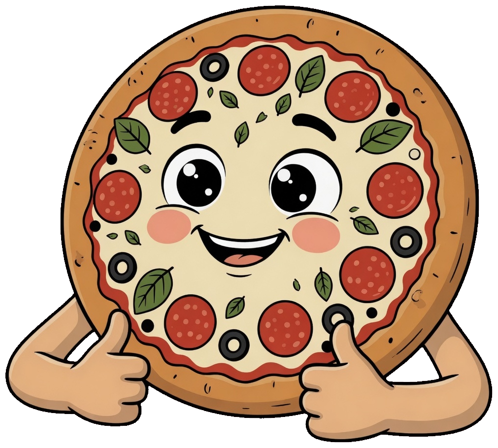

# PAZZO

Fictional wood-fired Neapolitan pizzeria landing page — a portfolio project.

Warm dark UI, gold accents, bilingual copy (EN / UA), and a cartoon mascot. Built as a marketing site: menu, deals, reviews, and a callback form (UI only, no backend).

<p align="center">
  <a href="https://pizza-landing-henna.vercel.app">
    
  </a>
</p>

<p align="center">
  
</p>

---

## What’s on the page

- **Hero** — headline, CTAs, mascot (tablet & desktop)
- **About** — story from 2019 + timeline
- **Why PAZZO** — oven, 48h dough, delivery, late hours
- **Menu** — six 12″ signature pies
- **Deals** — promo codes you can copy
- **Reviews** — guest quotes
- **Order** — contacts + callback form (front-end demo)
- **i18n** — English / Ukrainian, remembered in `localStorage`
- **Theme** — dark (default) and light

## Stack

| | |
|---|---|
| Framework | [Next.js](https://nextjs.org) 16 (App Router) |
| UI | React 19, Tailwind CSS 4 |
| Motion | Framer Motion |
| Icons | Lucide |
| Font | Nunito (`next/font`) |

## Project structure

```
src/
  app/           # layout, global styles, home page
  components/    # sections and UI (navbar, hero, menu, …)
  i18n/          # dictionaries + language context
  theme/         # dark / light theme context
public/
  mascot-hero.png
  mascot-about.png
  menu/          # product photos
```

## Run locally

```bash
npm install
npm run dev
```

Open [http://localhost:3000](http://localhost:3000).

```bash
npm run lint    # ESLint
npm run build   # production build
npm start       # serve the build
```

## Notes

- Fictional brand. Address, phone, and reviews are demo content.
- The order form only shows a success state in the browser — nothing is sent to a server.
- Language and theme persist in `localStorage` (`pazzo-locale`, `pazzo-theme`).

## License

Personal portfolio piece. Use as a reference if you want; the PAZZO name and copy are made up for this demo.
# pizza-landing
